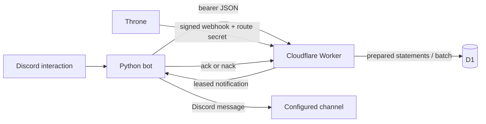
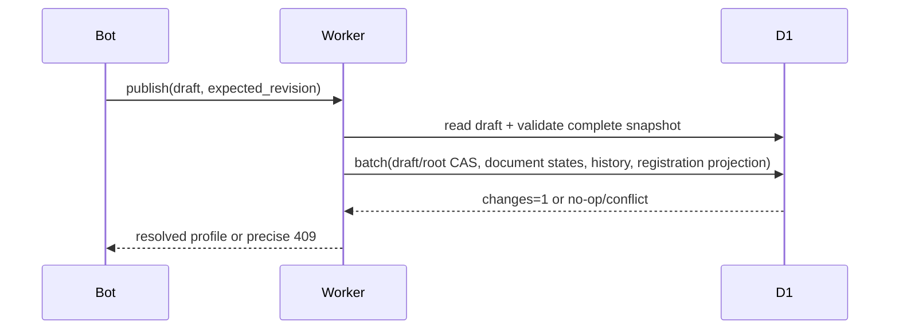
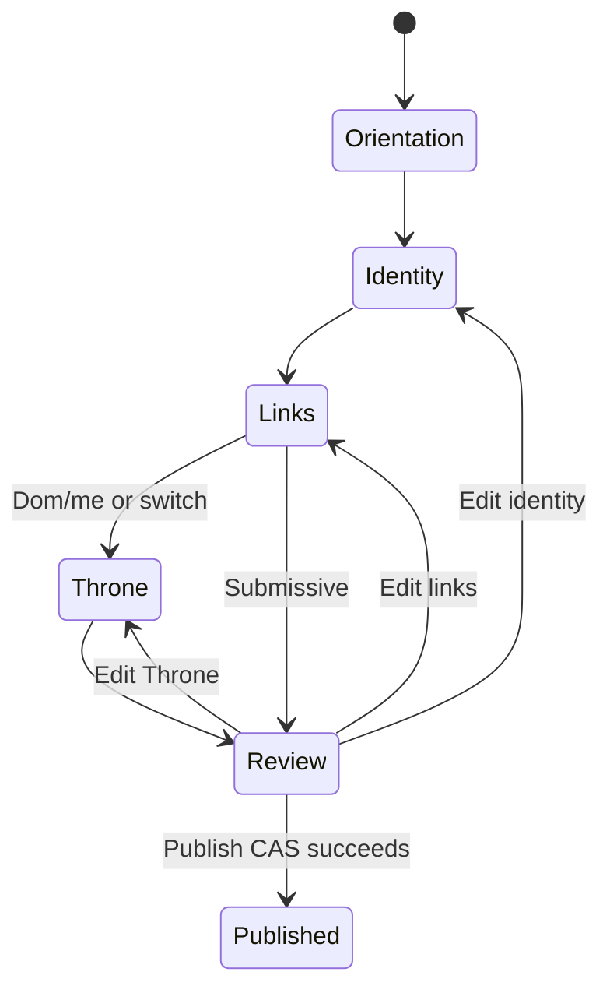

# Codebase guide

This guide is a reading path for contributors learning how Bill keeps Discord
interaction state, D1 state, and Throne delivery behavior consistent.

## Suggested reading path

1. `bill/settings.py`, then `worker/src/env.ts`: the same home-guild and API
   boundary configuration is validated on both sides.
2. `worker/migrations/0001_init.sql`, `0002_profile_system.sql`, and
   `0003_links_and_setup.sql`: existing send tracking first, then additive
   profile documents/drafts, then link imports/setup sessions/attribution.
3. `worker/src/profile/contracts.ts` and `documentStore.ts`: fixed values,
   validation limits, immutable document snapshots, and guarded batch writes.
4. `draftService.ts`, `resolver.ts`, and `publishService.ts`: durable editing,
   sparse inheritance, optimistic revisions, and atomic publication.
5. `worker/src/routes/profile*.ts` and `bill/worker_client.py`: the typed
   Worker/bot boundary.
6. `bill/cogs/profile.py` and `bill/components/`: Discord command routing,
   persistent dynamic controls, and concrete Components V2 renderers.
7. `guildSetupService.ts` and `bill/cogs/setup.py`: the separate public setup
   state machine.
8. `webhookThrone.ts`, `aliasAttribution.ts`, and `notifications.py`: signed
   ingestion, future-send attribution, leasing, delivery, and reconciliation.

## Runtime data flow



The bot is a renderer and Discord authorization boundary. The Worker is the
durable application-state boundary. A process restart may remove Python
objects, but it cannot lose a profile draft or setup session because every
callback reconstructs state from D1.

## Migrations and immutable documents

Migration `0001` is preserved exactly because it owns all v1 guild, Throne,
send, and notification data. `0002` adds profile documents, roots, sparse
overrides, publication history, and drafts. `0003` adds static link imports,
public guild setup sessions, nullable future-send attribution, and
`profile_managed` registration provenance. Existing registrations default to
legacy provenance and are never silently replaced by a profile.

A published document is never edited. Starting an edit clones the currently
applicable snapshot into a private draft document. A root points to one
published document and carries a version. Final publication is one D1 batch:



D1 cannot hold an application transaction open across multiple requests.
Mutations therefore use supported batches whose writes share old-revision or
new-state `EXISTS` guards and whose CAS result is checked. Publication also
feeds a guarded scalar into a required history field, turning a stale zero-row
CAS into a constraint failure that rolls the batch back. A zero-row update is
not itself an error, so every batch must either inspect the guard result or use
an equivalent rollback tripwire.

## Profile wizard state machine



Linked server drafts omit orientation and Throne because both come from the
live global profile. Completed sections render collapsed summaries, but D1 step
rows—not the rendered message—decide what is complete. Custom IDs bind the
draft/session, revision, action, user, and guild context. Dynamic persistent
items route interactions after bot restarts; each callback still reloads and
re-authorizes the durable record. UUIDs, snowflakes, and revisions use
reversible compact encodings so this context remains within Discord's
100-character custom-ID limit.

## Global, linked, and independent resolution

The home guild reads `global_profiles`. Another guild requires a
`server_profiles` root. Independent roots resolve their complete document.
Linked roots read the latest global document, apply only fields with explicit
override markers, remove explicitly hidden inherited links, add local links,
and choose the first valid visible payment fallback deterministically.

This design prevents global edits from becoming stale copies while still
allowing a member to clear a field or hide one link in a particular server.

## Bot/Worker boundary

`bill/worker_client.py` owns JSON parsing and converts responses into frozen
dataclasses/enums. Cogs and views should not index arbitrary Worker dictionaries.
HTTP status and Worker error codes remain available so interaction code can
distinguish stale revisions, missing drafts, forbidden callbacks, and validation
errors without turning every failure into a generic message.

The API token authenticates the bot service. Discord-side callbacks additionally
check the acting user, guild, Manage Server permission where appropriate,
channel type, and Bill's current channel permissions. Never trust a custom ID
alone: it is a routing hint, not authority.

## Throne, aliases, and delivery

The profile system reuses the v1 creator and registration projection. Existing
registrations and hash-only route secrets remain compatible. Creator resolution
is idempotent by normalized Throne identity; secret plaintext is returned once
on issue or explicit rotation. Registration projection keeps the established webhook fan-out path unchanged.
Publication and guild-setup completion append this projection to their own D1
batches. A profile-managed row may be refreshed or deactivated; a conflicting
legacy row produces an explicit publication conflict and remains authoritative
during guild setup.

Alias attribution happens at webhook time for each recipient guild. Effective
aliases follow the same linked/independent resolver rules as public profiles.
Private and anonymous events bypass attribution, and ambiguous matches produce
no owner. Existing sends are never rewritten.

Notification leasing remains independent from profile setup. Stable Discord
nonces and footer markers reconcile a post that succeeded before its Worker ack.

## Tests

Python:

```bash
python3 -m compileall -q bill
python3 -m ruff check bill tests
python3 -m pytest -q
```

Worker:

```bash
cd worker
npm ci
npm run check
```

Migration tests apply additive SQL over populated fixtures. Contract tests pin
the Python/Worker field names. Importer tests use injected DNS/fetch behavior so
blocked address classes, redirects, timeouts, content types, and size limits are
deterministic.

## Deployment

Use one home-guild snowflake in both runtimes. For production, preserve D1 ID
`6333cb0a-0c23-44b2-9022-a6fde1500f77` and `https://usebill.dev`. The live
order is:

1. Set Worker `BILL_HOME_GUILD_ID`.
2. `cd worker && npx wrangler d1 migrations apply bill --remote`
3. `npx wrangler deploy`
4. Set the same bot `BILL_HOME_GUILD_ID` and restart the bot.

See `docs/deployment.md` for the complete host setup and required secrets.

## Troubleshooting

| Symptom | Check |
| --- | --- |
| Global profile is rejected | Both runtimes have the same decimal `BILL_HOME_GUILD_ID`. |
| A button says it is stale | Reload/resume the durable draft; another callback advanced its revision. |
| DM onboarding stops | The member allows DMs from the server; the guild response explains closed-DM recovery. |
| Link import is blocked | Use manual HTTPS entry; static import intentionally rejects unsafe DNS/redirect/content. |
| Setup cannot select a channel | Bill currently has all four required permissions in a text channel. |
| Throne test succeeds but no post appears | Check active registration projection, guild config, notification lease state, and bot channel access. |
| A send has no alias owner | The send is private/anonymous, predates `0003`, has no match, or matches multiple owners. |

Do not print webhook URLs, API tokens, raw payloads, or private draft contents
while troubleshooting.

## Safe exercises

1. Add a new display-only link provider mapping with unit tests; do not weaken
   URL validation or importer DNS policy.
2. Add a resolver test showing explicit-empty bio override versus inherited bio.
3. Add a contract parser rejection case for a Discord length limit.
4. Add a setup-session stale-revision test using the existing D1 fixture.
5. Trace one notification lease through ack and reconciliation tests without
   changing production retry defaults.
